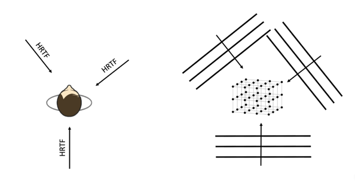
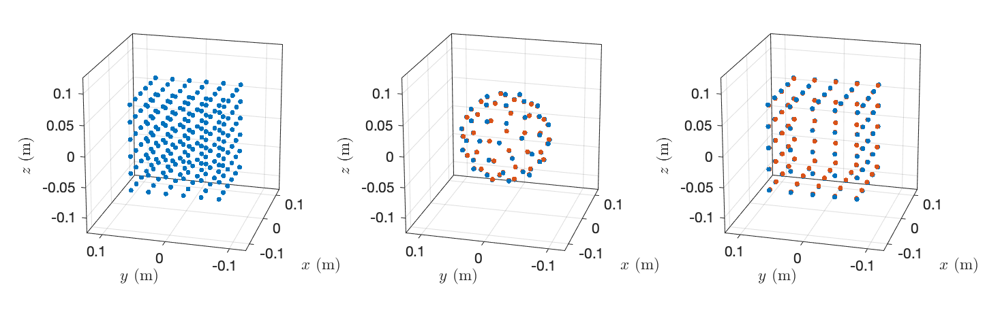

# Acoustic Room Responses in a Variety of Formats

The scripts in this repository compute perceptually very plausible acoustic room responses in the following formats:

* Binaural
* Volumetric sound pressure
* Volumetric particle velocity
* Spherical harmonic coefficients (ambisonics)

Performing research in acoustic signal processing is often facilitated by simulation of application scenarios. Simulating perceptually plausible responses of acoustic spaces is not straightforward. Room acoustic simulations based on the image source method are straightforward, which may be one of the reasons why many researchers opt for employing it when evaluating their methods. This can be useful in many situations but has its limitations if the output of a method is intended to be auralized. In most situations, data from the image source method do simply not sound plausible, they can exhibit reflection patterns that are very regular, and it is difficult to simulate diffuse reverberation with the image source method.

The methods in this repository provide an alternative for creating room acoustic responses in a variety of formats that are more favorable for auralization. Check out some audio examples [here](https://www.ta.chalmers.se/research/audio-technology-group/audio-examples/acoustic-room-responses/). The methods that are provided can be seen as variants of the reproduction that is part of the classical Spatial Decomposition Method (SDM). (We will eventually extent this repository to also comprise other parametric methods like [HO-SIRR](https://github.com/leomccormack/HO-SIRR).)

You will need to download the employed HRIRs of a Neumann KU 100 manikin from [here](https://zenodo.org/record/3928297/files/HRIR_L2702.sofa?download=1) and store them in the subfolder `hrtfs` (The MATLAB script is going to do that automatically for you, both the downloading and creating that folder.) as well as the SOFA MATLAB API from [here](https://sourceforge.net/projects/sofacoustics/) for being able to obtain the binaural output. 

## Basic Concept

SDM representations of room responses are measured with compact microphone arrays. SDM assigns an incidence direction to each digital sample of a pressure room impulse response. Binaural reproduction of the representation consists essentially in imposing the HRTF that corresponds to the incidence direction of a given digital pressure sample onto that sample and summing up for all digital samples. Computing a volumetric sound pressure field based on SDM data consists in imposing any given digital sample onto a plane wave that propagates over the sampling grid in the according direction. The same principle can be applied to the particle velcocity, too. The following image illustrates the principle for both binaural output and volumetric sound fields.



## Limitations

Auralization of SDM data can sound very plausible, and the data that our scripts compute from it are physically meaningful representations of an acoustic room responses. Yet, SDM data are not an accurate representation of the measured response but an approximation so that they do not sound identical to the original room. This may be tolerable in many situations.

An SDM representation of a room response works only for a small portion of space around the coordinate origin because moving away from the origin scrambles the arrival times of the reverberation. This is in principle also the case the real life. But it happens in a slightly different way in SDM. For example, moving in direction opposite of the direct sound incidence direction in SDM can cause the direct sound to arrive after the first reflections from that opposite direction because one may unknowingly have translated through a wall. The sound field that our scripts compute are physically meaningful even in that case. But the perceptual properties of the room response may be altered. We are not able to give guidelines as to how large the space is over which the data produced by our script are useful. We have not observed limitations in this regard yet.

In the current stage, the direct sound source is always far way from the coordinate origin. We will eventually integrate an option to also have close sources.

## Room Data

For the time being, we provide SDM data only for two different rooms in the files `room_data/sdm_big_hall.mat` and `room_data/sdm_listening_lab.mat`. Big Hall is a public space at Chalmers. It has a complicated geometry and mostly rigid walls and floor. Its reverb time is around 1 s. Listening Lab is a smaller, living room-sized space with highly absorbing walls and ceiling as well as a concrete floor. Its reverb has decayed after approx. 0.2 s.

Execute `sdm_data = load('room_data/sdm_listening_lab.mat')` in the MATLAB command window to see what format of the SDM data our scripts expect:
```
sdm_data = 
  struct with fields:
                        p: [6000×1 double]
                  azi_rad: [6000×1 double]
                  ele_rad: [6000×1 double]
                       fs: 48000
                     room: 'listening lab'
```
`p` is the pressure room impulse response, and `azi_rad` and `ele_rad` are the incidence directions in radians of each of the digital samples of `p`. `fs` is the sampling frequency of `p`, `azi_rad`, and `ele_rad`. Resampling of the SDM data is performed automatically if the desired sampling rate is different. `room` is an optional string for storing a description of the data.

## Examples

### Binaural 

See the script `sdm_to_binaural.m`. This is essentially the standard binaural reproduction of SDM yet simplified because we do not incorporate an equalization stage. All data that we have tested so far do not require it. 

The file `binaural_sdm_big_hall.wav` is an example output computed with that script. You will find a few more binaural audio examples [here](https://www.ta.chalmers.se/research/audio-technology-group/audio-examples/acoustic-room-responses/).

### Volumetric sound pressure and particle velocity

See the script `sdm_to_pressure_velocity.m`. You can choose from three different types of grids: 

* Cubical volumetric grid
* Spherical surface grid 
* Cubical surface grid.

The grids are inspired by the [Chalmers Auralization Toolbox](https://github.com/AppliedAcousticsChalmers/auralization-toolbox). Here are illustrations of them:



The assumption is that one would want to handle one of the following cases:

* The pressure is sought on a volumetric grid.
* The pressure is sought on a double-layer surface that is either cubical or spherical.
* Pressure and normal particle velocity are sought on a single-layer surface that is either cubical or spherical.

The options that you can choose from in the script are according. 

### Spherical harmonic coefficients 

See the script `sdm_to_ambisonics.m`. Here, the SDM dara are also imposed on plane waves with the difference that a spherical harmonic representation of the total sound pressure field is stored rather than that the pressure or velocity are computed on a sampling grid. The spherical harmonic representation can be computed at any arbitrary spherical harmonic order without spatial aliasing or other systematic impairments. Depending on your version of MATLAB, numerical issues may arise at orders of 40 or higher.

One can use this script to, for example, compute the sound pressure at the microphones of a rigid spherical microphone array due to the SDM representation of the reverb. Run the scripts `sdm_to_ambisonics.m`, `ambisonics_to_sma.m`, and `render_sma_to_ambisonics.m` (from [this repository](https://github.com/AppliedAcousticsChalmers/ambisonic-encoding)) in that order to render the microphone array signals binaurally.

### References

SDM was originally present in

> S. Tervo, J. Pätynen, A. Kuusinen, T. Lokki. "Spatial decomposition method for room impulse responses." JAES, 61:17–28, Dec. 2013

Note that we do not perform equalization of the SDM as was originally proposed in

> S. Tervo, J. Pätynen, N. Kaplanis, M. Lydolf, S. Bech, and T. Lokki, “Spatial Analysis and Synthesis of Car Audio System and Car-Cabin Acoustics with a Compact Microphone Array,” JAES, vol. 63, no. 11, pp. 914–925, 2015.

See the [binaural audio examples](https://www.ta.chalmers.se/research/audio-technology-group/audio-examples/acoustic-room-responses/) to verify if the output of our scripts serves your purpose.
